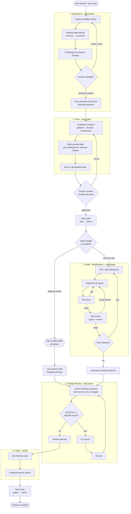

# The Structured Agentic Development Workflow

*A pragmatic approach to building complex software with autonomous AI agents. This methodology shifts the developer's role from Individual Contributor to Engineering Manager, focusing on deterministic outcomes, architectural integrity, and continuous improvement.*

---

## The Philosophy: Beyond "Vibe Coding"

Working with LLMs for software development often devolves into "vibe-based coding"—you ask for a massive feature, the AI hallucinates a messy implementation, breaks existing dependencies, and you spend the next three hours in debugging hell.

The **Structured Agentic Development Workflow** treats the AI not as a magical junior developer who can read your mind, but as an incredibly fast, highly capable engineer that *lacks object permanence*. To get senior-level results, you must provide a rigid scaffolding of context, constraints, and deterministic planning.

### The Trade-offs

**Benefits:**
*   **Architectural Integrity:** You get maintainable, predictably structured code instead of a patchwork of different styles.
*   **Near-Zero Regressions:** Because changes are isolated and tested phase-by-phase, bugs are caught instantly.
*   **Elimination of "Vibe-Lost" Time:** You spend less time untangling spaghetti code and more time in active, forward-moving development.
*   **Role Elevation:** You operate as a Tech Lead defining the "what" and "how," delegating the keystrokes to the agent.

**Drawbacks:**
*   **Higher Token Consumption:** Planning and context-loading consume significantly more tokens (and therefore money) than zero-shot coding.
*   **Higher Active Involvement:** You cannot simply prompt "build the app" and walk away. This workflow demands your constant attention as a reviewer and decision-maker.

---

## Installation

### Quick Start

```bash
# Clone the repo
git clone https://github.com/nikhilw/structured-agentic-workflow.git
cd structured-agentic-workflow

# Install for all supported agents
./install.sh

# Or on Windows (PowerShell — requires Developer Mode or admin)
.\install.ps1
```

### What the Installer Does

1. **Pulls superpowers skills** — sparse-clones [obra/superpowers](https://github.com/obra/superpowers) (MIT-licensed) into `vendor/superpowers/`, then copies the adopted skills into `skills/` with appropriate renaming.
2. **Symlinks all skills** into the global skills directory for each supported agent:

| Agent | Skills Directory |
|-------|-----------------|
| Claude Code | `~/.claude/skills/` |
| Cursor | `~/.cursor/skills/` |
| Gemini CLI | `~/.gemini/skills/` |
| GitHub Copilot | `~/.config/github-copilot/skills/` |

> **Note:** Cursor also reads `~/.claude/skills/` natively, so installing for Claude Code alone is sufficient if you use both.

All skills use the standard `SKILL.md` format supported by all four agents.

### Targeting a Specific Agent

```bash
./install.sh --target claude        # Claude Code only
./install.sh --target gemini        # Gemini CLI only
./install.sh --target cursor        # Cursor only
./install.sh --target copilot       # GitHub Copilot only
```

### Other Options

```bash
./install.sh --local                # Skip superpowers pull (use existing vendor/)
./install.sh --remove               # Remove all symlinks
./install.sh --remove --target claude  # Remove for a specific agent
./install.sh --list                 # Show agents and install status
```

### Installed Skills

The installer symlinks these skills from the `skills/` directory:

**Core workflow skills:**

| Skill | Source | Description |
|-------|--------|-------------|
| `agentic-workflow` | This project | Orchestrates the full development lifecycle |
| `brainstorm` | This project | Explore approaches, challenge the design, estimate impact, produce decision documents |
| `write-plan` | This project | Write phased implementation plans |
| `build-phase` | This project | Execute one plan phase with test + review loop |
| `3p-review` | This project | Independent third-person code review |
| `triage` | This project | Recommend next task, minimize context thrash |
| `test-driven-development` | [superpowers](https://github.com/obra/superpowers) | RED-GREEN-REFACTOR discipline |
| `debug` | [superpowers](https://github.com/obra/superpowers) | Systematic 4-phase root cause investigation |
| `verify` | [superpowers](https://github.com/obra/superpowers) | Evidence before completion claims |

**Optional vendor skills (installed but not part of the workflow):**

| Skill | Source | Description |
|-------|--------|-------------|
| `brainstorming` | [superpowers](https://github.com/obra/superpowers) | Interactive brainstorming with visual companion and spec review loop. Not used by the workflow — available if you prefer it over `/brainstorm`. |

### Manual Installation

If the install script doesn't work on your system, you can do it by hand. There are two steps: pulling the superpowers skills, and symlinking everything into your agent's skills directory.

#### Step 1: Pull Superpowers Skills

Clone the superpowers repo and copy the skills you need into `skills/`:

```bash
# Clone superpowers into a temp directory
git clone --depth 1 https://github.com/obra/superpowers.git /tmp/superpowers

# Copy the four adopted skills into vendor/ (for reference)
mkdir -p vendor/superpowers
cp -r /tmp/superpowers/skills/brainstorming vendor/superpowers/
cp -r /tmp/superpowers/skills/test-driven-development vendor/superpowers/
cp -r /tmp/superpowers/skills/systematic-debugging vendor/superpowers/
cp -r /tmp/superpowers/skills/verification-before-completion vendor/superpowers/
cp /tmp/superpowers/LICENSE vendor/superpowers/

# Copy into skills/ with our naming
cp -r /tmp/superpowers/skills/brainstorming skills/brainstorming
cp -r /tmp/superpowers/skills/test-driven-development skills/test-driven-development
cp -r /tmp/superpowers/skills/systematic-debugging skills/debug
cp -r /tmp/superpowers/skills/verification-before-completion skills/verify

# Patch the skill name in renamed skills so /debug and /verify work
sed -i 's/^name: systematic-debugging$/name: debug/' skills/debug/SKILL.md
sed -i 's/^name: verification-before-completion$/name: verify/' skills/verify/SKILL.md

# Clean up
rm -rf /tmp/superpowers
```

#### Step 2: Symlink Skills

Create symlinks from the `skills/` directory to your agent's global skills directory. Replace `~/.claude/skills` with the appropriate path for your agent (see the table above).

**macOS / Linux:**

```bash
mkdir -p ~/.claude/skills

# Symlink each skill
ln -sf "$(pwd)/skills/agentic-workflow" ~/.claude/skills/agentic-workflow
ln -sf "$(pwd)/skills/brainstorming" ~/.claude/skills/brainstorming
ln -sf "$(pwd)/skills/write-plan" ~/.claude/skills/write-plan
ln -sf "$(pwd)/skills/build-phase" ~/.claude/skills/build-phase
ln -sf "$(pwd)/skills/3p-review" ~/.claude/skills/3p-review
ln -sf "$(pwd)/skills/triage" ~/.claude/skills/triage
ln -sf "$(pwd)/skills/test-driven-development" ~/.claude/skills/test-driven-development
ln -sf "$(pwd)/skills/debug" ~/.claude/skills/debug
ln -sf "$(pwd)/skills/verify" ~/.claude/skills/verify
ln -sf "$(pwd)/skills/brainstorm" ~/.claude/skills/brainstorm
```

**Windows (PowerShell — requires Developer Mode or admin):**

```powershell
New-Item -ItemType Directory -Path "$env:USERPROFILE\.claude\skills" -Force

# Symlink each skill (run from the repo root)
$skills = Get-ChildItem -Path ".\skills" -Directory
foreach ($skill in $skills) {
    New-Item -ItemType SymbolicLink `
        -Path "$env:USERPROFILE\.claude\skills\$($skill.Name)" `
        -Target $skill.FullName -Force
}
```

#### Step 3: Verify

```bash
ls -la ~/.claude/skills/
```

Each entry should be a symlink pointing back to the `skills/` directory in this repo.

---

## 1. Project Initialization & Context Scaffolding

Before you prompt the AI to write a feature, you must establish its world. Let's imagine a hypothetical project: **SyncScribe**, a real-time collaborative Markdown editor. 

Create a dedicated `docs/` or `.ai/` directory in your project root containing:

1. **`ai-context.md` (The Worldview)**
   - *Example:* "SyncScribe uses FastAPI (Python 3.13) for the backend and React (TypeScript) for the frontend. We use CRDTs (Yjs) for state resolution. All database interactions must go through the Repository layer."

2. **`CLAUDE.md` (The Persistent System Prompt)**
   - Most agentic coding tools (Claude Code, Cursor, Windsurf) support a project-level instruction file—`CLAUDE.md`, `.cursorrules`, etc. This file is loaded into every conversation automatically and acts as the agent's persistent memory of your project's architecture, conventions, and hard rules.
   - **Why this matters beyond built-in plan mode:** Tools like Claude Code already have a "plan mode" where the agent plans before building. But plan mode alone does not keep the agent *focused*. Left to its own devices, the agent will start researching tangential topics, propose unnecessary refactors, or drift from your architecture. `CLAUDE.md` is the leash—it keeps the agent honest, informed, and aligned with your project's reality without requiring you to repeat context every conversation.
   - *Example contents:* "SQLite is the source of truth. Config uses Dynaconf + dataclasses. Entity relationships are stored by NAME not ID. Cost-conscious: use haiku/sonnet for bulk work, opus for planning only."

3. **The Backlog (`features.md`, `bugs.md`)**
   - A prioritized list of tasks. This grounds the AI. When a task is completed, the AI crosses it off, maintaining a shared sense of progress.

4. **Global System Prompt & Predefined Skills**
   - **Initial Prep (The Skill-set):** Equip the AI with predefined skills *before* the first task.
     - **Clean Code & Patterns:** Hard-code instructions for naming conventions, SOLID principles, and design patterns.
     - **Project-Specific standards:** Define exactly how configuration management (e.g., Dynaconf) or logging (e.g., RichHandler) should be implemented.
   - **Strict Rules (The Guardrails):**
     - *Example:* "Do not use `any` types in TypeScript; define strict interfaces for all API payloads."
     - *Example:* "Always use the public APIs of third-party libraries; do not import internal private modules."

5. **List Your Workflow Skills in Your Agent's Config File**
   - Skills installed globally are automatically discovered by the agent. However, explicitly listing them in your agent's project-level config file ensures they are loaded into context at the start of every conversation, so the agent knows the workflow exists and can suggest phase transitions proactively.
   - The config file depends on your agent:
     - **Claude Code:** `CLAUDE.md` (project root)
     - **Cursor:** `.cursorrules` (project root)
     - **Gemini CLI:** `GEMINI.md` (project root)
     - **GitHub Copilot:** `.github/copilot-instructions.md`
   - *Example (add to whichever file your agent uses):*
     ```markdown
     ## Workflow Skills
     - `agentic-workflow` — orchestrates the structured development lifecycle
     - `/brainstorm` — explore problem space, challenge the design, produce decision documents
     - `/write-plan` — write phased plans to docs/plans/new/
     - `/build-phase` — execute one plan phase with test + self-review
     - `/3p-review` — independent third-person code review (after all build phases)
     - `/triage` — recommend next task minimizing context thrash
     - `/test-driven-development` — RED-GREEN-REFACTOR discipline
     - `/debug` — systematic root cause investigation
     - `/verify` — evidence before completion claims
     ```

---

## 2. The Development Lifecycle

Every significant change must follow a rigid, iterative cycle: **Brainstorm → Plan → Build → 3rd-Person Review → Verify**.



### Step 1: The Brainstorm Phase
Do not ask the AI to "build offline support." Ask it to explore the problem space. **Code is the last thing we touch** — the brainstorm phase enforces a hard gate against any implementation.

*   **Prompt Example:** *"We need offline support for SyncScribe. Analyze our current WebSocket sync layer in `frontend/src/sync/` and propose three architectural ways to queue local edits for reconnection. Consider IndexedDB vs localStorage."*
*   **The Human's Active Role:** While the AI generates its analysis, **you are doing parallel research** (via Perplexity or Google).
*   **The Pivot:** Often, you will discover a library or approach the AI missed.
    *   *Human response:* *"Your IndexedDB proposal is good, but I just found a new library `RxDB` that handles conflict resolution better. Let's discard these three options and pivot to exploring an RxDB adapter approach instead."*

#### Decision Documents

Brainstorming sessions are where architectural decisions happen. The `/brainstorm` skill will offer to save the discussion as a **decision document** to `docs/discussions/YYYY-MM-DD-<topic>.md` — a structured record of which approaches were considered, the impact of each, why the chosen approach won, and what was rejected. These documents are invaluable when someone later asks "why did we do it this way?"

### Step 2: The Planning Phase
The AI must write a formal technical specification *before* writing any code. The plan must resolve **all** design decisions — the dev model executes, it does not design.

*   **Model Scoping:** You can specify which model should handle the build.
    *   *Prompt Example:* *"Write a detailed technical plan for the RxDB adapter. Save it to `docs/plans/offline-sync.md`. Divide this into isolated Phases. **Plan this specifically for a smaller model (e.g., Gemini 2.5 Flash)** to execute—be hyper-granular and explicit."*
*   **Human Role:** Review the Markdown plan. Correct architectural misunderstandings. Approve the plan.
*   **On approval:** Move the plan from `docs/plans/new/` to `docs/plans/` — this marks it as the active plan.

#### The Plan Directory Workflow: `plans/`, `plans/new/`, `plans/done/`

Plans are not throwaway conversation artifacts—they are versioned project assets with a deliberate lifecycle.

*   **`docs/plans/new/`** — Plans that have been brainstormed and written but not yet approved or started. This is the staging area.
*   **`docs/plans/`** — The active plan currently being executed.
*   **`docs/plans/done/`** — Completed plans, kept as an audit trail and architectural reference.

**Why write plans to disk instead of keeping them in the agent's head?**

1.  **Agent decoupling:** The agent that *plans* does not have to be the agent that *builds*. You can brainstorm a plan with Claude Opus, then hand the plan file to Gemini Flash or a local model for execution. The plan is the contract between them.
2.  **Brainstorm preservation:** When the plan lives as a file on disk, the agent does not enter its internal "planning → executing" loop. It stays in brainstorm mode, which is exactly where you want it during the design phase. If the plan lived only in conversation context, the agent would immediately start nagging you to implement it, cutting short the critical thinking phase.
3.  **Parallel workflow:** Plans can accumulate in `plans/new/` while you focus on other work. You choose *when* to pick them up—based on your available tokens, your own availability, and the complexity of the task. This decouples planning velocity from implementation velocity and lets you run both in parallel.

### Step 3: The Build Phase (The Phase-Wise Loop)
Execute the plan strictly **one phase at a time** using the internal loop: `TDD -> Implement -> Test -> Self-Review -> Proceed`.

The build phase can be executed by the **same model** that planned, or handed off to a **different model** (smaller, faster, cheaper). The plan is the contract — it contains all decisions, so the dev model just executes.

1.  **TDD (Mandatory):**
    *   Every phase starts with `/test-driven-development`. Write the failing test first (red), implement to green, then refactor. No production code without a failing test first.
2.  **Implement:**
    *   *Prompt Example:* *"Execute Phase 1 (Database Schema) from `docs/plans/offline-sync.md`."*
    *   If the plan is ambiguous or contradictory, the dev model surfaces the discrepancy to the user — it does not guess or make design decisions.
3.  **Test:**
    *   Run the unit/integration tests for that specific module.
4.  **Self-Review:**
    *   The agent reviews its own changes with a critical eye — does the code match the plan, follow conventions, have obvious bugs? The human confirms before proceeding.
    *   This is a lightweight per-phase check, not the full third-person review. It keeps each phase honest without the overhead of a full persona switch.
5.  **Proceed:**
    *   *Prompt Example:* *"Tests pass and self-review is clear. Proceed to Phase 2."*

#### The Handoff Summary

After all phases are complete, the build agent generates a **handoff summary** — a concise report of what was built, any deviations from the plan, implementation notes, and open concerns. If the build was done by a different model, this summary is the artifact the user carries back to the planning model for review.

### Step 4: Holistic Third-Person Review

After ALL build phases are complete (and the handoff summary is generated), invoke the full `/3p-review`. If the build was done by a different model, the user returns to the planning model, which runs this review.

*   The philosophy: **"I didn't write this code, but after this review it is my responsibility. It must meet my world-class standards."** This is not a rubber stamp — it is the moment you reap the benefits of pair programming. The original author has blind spots; the reviewer does not share them.
*   The reviewer looks at architectural coherence, cross-cutting concerns, and systemic issues that only become visible when reviewing the full change set — not just individual phases.
*   This is a loop: if the review surfaces CRITICAL or MAJOR issues → fix → re-test → re-review from scratch until clean.
*   `/3p-review` can also be invoked independently at any time — not just at the end of a build cycle.

### Step 5: Verify and Archive

After `/3p-review` passes, immediately run `/verify` — evidence before claims. Then move the plan from `docs/plans/` to `docs/plans/done/`. The feature is complete.

**Final Validation:** ALL project tests must pass. No feature is "done" until the suite is green and the plan is archived.

---

## 3. Task Selection Strategy: Bugs vs. Features

Not all work is created equal, and your available resources—tokens, time, mental energy—should dictate what you pick up next. This is a deliberate triage strategy, not procrastination.

### When Tokens Are Low: Pick Bugs

Bug fixes are typically small, well-scoped, and self-contained. They require minimal brainstorming and can often be resolved within a single conversation. When your token budget is running low or you only have a short window of availability, bugs are the highest-value work you can do. They improve the product without demanding the deep planning overhead of a new feature.

### When Tokens Are Plentiful: Work on Features and Plans

Feature development requires the full Brainstorm → Plan → Build cycle. It consumes significantly more tokens and demands your sustained attention as a reviewer. Save this work for sessions where you have the budget and the bandwidth.

### Let Plans Accumulate—That's a Feature, Not a Bug

Plans in `docs/plans/new/` are not a backlog to feel guilty about. They are *pre-invested design work* waiting for the right moment. You can brainstorm three plans in the morning, let them sit, and implement them in the afternoon—or next week. This decouples *thinking* from *doing* and lets you work on both in parallel, far more easily than a traditional workflow allows.

**A critical mindset shift:** With AI-assisted development, "later" does not mean months. It means minutes or hours. The time between "plan written" and "feature shipped" has collapsed. So accumulating plans is not deferring work—it is *staging* work for rapid, parallel execution.

---

## 4. Continuous Improvement: The Memory Loop

Even with strict planning, AI models drift. The system must adapt immediately to failures. This is the last and most vital step.

### The "No Surprises" Rule
Always enforce this constraint: **"NEVER modify code without explicit permission. Propose changes one file at a time."**

### Continuous Memory Updates
Whenever you find an incorrect behavior or a rule violation, **update the AI's memory immediately** with exact, preventative instructions.

*   **Example (Logging violation):** The AI uses `print()` instead of your project's custom logger.
    *   *Action:* Fix the code, then say: *"You violated our logging standard. Update your `ai-context.md` or memory: 'Rule: Always use `logger = get_logger(__name__)` and never use `print()`. This is non-negotiable.'"*
*   **Example (Refactoring drift):** The AI refactors a function and removes comments explaining a complex regex.
    *   *Action:* *"You deleted vital documentation. Restore it and update your memory: 'Do not remove business-logic comments during refactoring without asking first.'"*

### Refactoring Monoliths
Treat refactoring as a feature:
1. Ask the AI to analyze the monolith and propose domain boundaries.
2. Generate a phased refactoring plan.
3. Execute using the `TDD -> Implement -> Test -> Self-Review` loop for every single file extraction.
