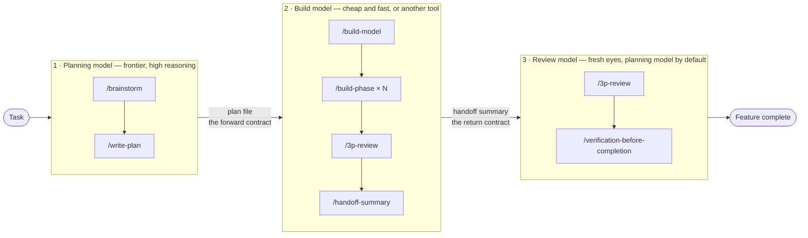

# The Structured Agentic Development Workflow

*Agent skills that keep humans and AI agents focused while building real software — and let
you spend frontier-model reasoning on design while a cheaper model does the typing.*

Every significant change follows one cycle:
**Brainstorm → Plan → Build → 3rd-Person Review → Verify.**
Phases are never skipped, plans are files rather than conversations, and nothing is "done"
without evidence.

---

## Setup

### 1. Install graphify (recommended)

Powers codebase search in `/brainstorm` and `/write-plan`. The workflow runs without it —
both skills fall back to grep after saying so once — but this is where a lot of the quality
comes from.

```bash
uv tool install graphifyy   # note the double-y; `graphify` on PyPI is an unrelated package
graphify install            # registers the /graphify skill with your agent
```

If the `graphify` command isn't found afterwards, run `uv tool update-shell`. `pipx install
graphifyy` and `pip install graphifyy` also work.

Add `graphify-out/` to your project's `.gitignore`; it is a build artifact.

### 2. Install the workflow skills

```bash
# Works with Claude Code, Cursor, Gemini CLI, Copilot, and 40+ other agents
npx skills add nikhilw/structured-agentic-workflow

# superpowers supplies TDD, debugging, and verification — strongly recommended
npx skills add obra/superpowers -s test-driven-development -s systematic-debugging -s verification-before-completion
```

Prefer one command that pulls everything? Clone the repo and run `./install.sh`
(`.\install.ps1` on Windows). Per-agent targets, manual steps, and the full skill inventory
are in [installation.md](docs/installation.md).

### 3. Point your project's agent config at the workflow

Add the workflow skills to `CLAUDE.md` / `AGENTS.md` (or `.cursorrules`, `GEMINI.md`,
`.github/copilot-instructions.md`) so the agent starts every conversation knowing the
workflow exists and can suggest phase transitions itself:

```markdown
## Workflow Skills

ALWAYS follow the Structured Agentic Development Workflow. These skills are installed
globally and define the development lifecycle:

- `agentic-workflow` — orchestrates the full lifecycle; suggests phase transitions automatically
- `/brainstorm` — explore the problem space before planning (no code, no plans)
- `/write-plan` — write phased plans to `docs/plans/new/` (agent-decoupled)
- `/build-phase` — execute one plan phase: test-first → implement → test suite → self-review
- `/build-model` — dedicated build-model session: build → 3p-review → handoff-summary → stop
- `/3p-review` — independent code review; the reviewer owns the code
- `/handoff-summary` — emit the fixed-format Build Handoff Summary
- `/verification-before-completion` — evidence before any "done" claim
- `/triage` — recommend the next task, minimizing context thrash

Startup default: load `agentic-workflow` at startup.
```

A fuller template — standing quality bar, architecture facts, hard rules, and what to keep
*out* of the file — is in [agent-config.md](docs/agent-config.md).

---

## Use

```
/brainstorm add offline support to the sync layer   # explore, challenge, decide
/write-plan offline-sync                            # phased plan → docs/plans/new/
                                                    # you review it, then: mv to docs/plans/
/build-phase docs/plans/offline-sync.md Phase 1     # TDD → test → self-review, per phase
/3p-review                                          # holistic review, loops until clean
/verification-before-completion                     # fresh evidence, then archive the plan
```

`agentic-workflow` drives these transitions for you — you rarely type the middle three. Ask
`/triage` when you are not sure what to pick up next.

**To hand the build to a cheaper model** (Sonnet is the usual choice, or another tool
entirely): approve the plan, `mv` it to `docs/plans/`, then in that session run
`/build-model docs/plans/offline-sync.md`. It reviews the plan first and halts if it finds a
defect, then builds every phase, reviews its own work, emits a handoff summary, and stops.
Bring that summary back to your main model, which re-reviews with fresh eyes and verifies.
Tier guidance is in [multi-model.md](docs/multi-model.md).

### The skills

| Skill | Does |
|---|---|
| `agentic-workflow` | Orchestrates the lifecycle and drives phase transitions |
| `/brainstorm` | Explores approaches, challenges the design, writes a decision document |
| `/write-plan` | Writes a phased, fully-decided plan to `docs/plans/new/` |
| `/build-phase` | Executes one phase: test-first → implement → suite → self-review |
| `/build-model` | Entry point for a dedicated build model: build → review → handoff → stop |
| `/3p-review` | Independent review that owns the code; loops until clean |
| `/handoff-summary` | Emits the fixed-format Build Handoff Summary |
| `/triage` | Recommends the next task, minimizing context thrash |
| `/github-backlog` | Maintains features and bugs as GitHub issues |
| `/workflow-config` | Sets TDD/BDD, output brevity, and backlog source |

Plus `test-driven-development`, `systematic-debugging`, and `verification-before-completion`
from [superpowers](https://github.com/obra/superpowers).

---

## Documentation

| Document | What's in it |
|---|---|
| [workflow.md](docs/workflow.md) | The full lifecycle, phase by phase, with the complete diagram |
| [multi-model.md](docs/multi-model.md) | The planning/build/review model split and the two contracts |
| [agent-config.md](docs/agent-config.md) | What to put in `CLAUDE.md` / `AGENTS.md` |
| [installation.md](docs/installation.md) | Per-agent targets, script options, manual install, skill inventory |
| [configuration.md](docs/configuration.md) | `/workflow-config` — TDD/BDD, caveman brevity, GitHub issues |
| [practices.md](docs/practices.md) | Task selection, refactoring monoliths, the "no surprises" rule |
| [philosophy.md](docs/philosophy.md) | Why the workflow is shaped this way |
| [extras/driving-cursor-as-build-model.md](docs/extras/driving-cursor-as-build-model.md) | Worked recipe: running Cursor's CLI agent headless as the build model |

---

## What makes this different

There are other agent-skill libraries — [obra/superpowers](https://github.com/obra/superpowers)
is the best known, and this workflow composes with it rather than competing. Five things set
this one apart:

**1 · The build model doesn't have to be the planning model.**
Because the plan is a *file* that resolves every decision, you can plan with Opus and build
with Sonnet — or hand the plan to Cursor, Gemini Flash, Copilot, or a local model entirely. Frontier reasoning is the scarcest resource in agentic development, and most of
the tokens a coding agent burns are not reasoning at all — they are reading files, writing
boilerplate, and re-running tests. This workflow is built so you stop paying frontier prices
for typing. → [multi-model.md](docs/multi-model.md)

> *Concretely: plan with Opus, then let Cursor's agent build the plan headless in the
> background. The whole build comes back to your expensive model as a few hundred bytes —
> a result line, not a transcript. [Here's the exact
> recipe.](docs/extras/driving-cursor-as-build-model.md)*

**2 · A review gate that takes ownership.**
`/3p-review` switches persona to an independent Senior Architect who *owns the code on
sign-off*, loops until **zero findings of any severity** (minors get fixed, not waved), and
cannot pass without a no-mock test across the real integration seam. Past a volume threshold
it refuses to fix things itself and emits a **Rework Brief** instead — a reviewer who rewrites
half the feature has become its author.

**3 · An enforced lifecycle, not a toolbox.**
One orchestrator drives the whole cycle with an explicit phase-transition table and a plan
lifecycle (`new/` → `plans/` → `done/`). The agent owns forward motion instead of stalling
between phases, and each phase has an exit gate that user approval cannot retroactively
satisfy.

**4 · The plan carries the foresight.**
A small build model fills every silence with the happy path. So `/write-plan` forces the
expensive model to write the foresight *down*: failure modes, lifetimes, error codes and
their owners, concurrency and aliasing, named seam tests per value path, and exact
command-plus-expected-output test criteria. Every name in the plan must be verified to exist,
or marked new.

**5 · Index-first codebase search.**
`/brainstorm` and `/write-plan` build and query a [graphify](https://github.com/safishamsi/graphify)
knowledge graph of the repo before proposing anything. The most expensive mistake in a
brainstorm is reimplementing something that already exists under a name nobody grepped for.


```mermaid
flowchart LR
    Start([Task]) --> P

    subgraph P ["1 · Planning model — frontier, high reasoning"]
        direction TB
        P1["/brainstorm"] --> P2["/write-plan"]
    end

    P -->|"plan file<br/>the forward contract"| B

    subgraph B ["2 · Build model — cheap and fast, or another tool"]
        direction TB
        B1["/build-model"] --> B2["/build-phase × N"]
        B2 --> B3["/3p-review"]
        B3 --> B4["/handoff-summary"]
    end

    B -->|"handoff summary<br/>the return contract"| R

    subgraph R ["3 · Review model — fresh eyes, planning model by default"]
        direction TB
        R1["/3p-review"] --> R2["/verification-before-completion"]
    end

    R --> Done([Feature complete])
```

Both build lanes are optional: the same model can carry the whole cycle. The split is there
when you want it.

---

## License

MIT. Superpowers skills are vendored under their own MIT license — see
`vendor/superpowers/LICENSE`.
