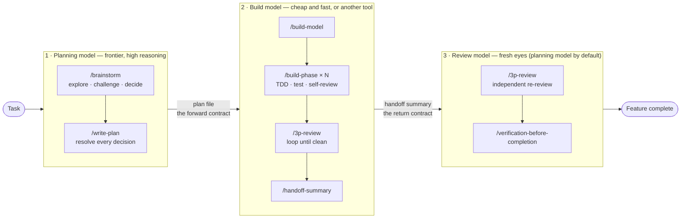

# The Multi-Model Split

*Buy expensive reasoning once. Spend cheap execution as often as you like.*

This is the part of the workflow that most other agent-skill libraries do not have, and it
is the reason the plan is a **file** rather than a conversation.

---

## The problem it solves

Frontier-model reasoning is the scarcest resource in agentic development. It is the most
expensive per token, the first thing you run out of under a usage limit, and — awkwardly —
it is *also* the thing that makes the difference between a good architecture and a mess.

Meanwhile, most of the tokens a coding agent burns are not reasoning at all. They are
mechanical: reading files, writing boilerplate, running the test suite, fixing an import,
re-running the test suite. That work does not need a frontier model. It needs a competent
one that is fast and cheap.

The usual failure is spending frontier tokens on all of it, running dry halfway through a
feature, and finishing the job with a degraded context and a tired plan.

## The split

Three roles. Two of them are mandatory; they are allowed to be the same model.

| Role | Does | Needs | Reasonable choices |
|---|---|---|---|
| **Planning model** | `/brainstorm`, `/write-plan` — explores the problem, challenges the design, resolves every decision, writes the plan file | Deep reasoning, long context, architectural judgment | Your best available model — Claude Opus, or whatever you reserve for hard thinking |
| **Build model** | `/build-model` → `/build-phase` per phase → `/3p-review` → `/handoff-summary` | Accurate code generation, tool use, patience | A cheaper/faster model, or a different tool entirely: Cursor, Copilot, Gemini Flash, a local model, a second Claude session on a smaller model |
| **Review model** *(optional)* | `/3p-review` on the returning change set, then `/verification-before-completion` | Fresh eyes, no authorship bias | Usually the planning model. Occasionally a *third*, deliberately different model — a reviewer that shares no blind spots with either author |

By default the planning model also reviews and verifies. Splitting the reviewer out is an
upgrade, not a requirement.

## Why it works: two contracts, no shared conversation

Nothing is passed between the models except two documents. Neither model ever needs the
other's conversation history.

**Forward contract — the plan file (`docs/plans/<feature>.md`).** `/write-plan` is written
to be paranoid about this: exact file paths, exact function signatures, exact test commands
with expected output, named seam tests for every value path, an explicit failure-mode and
interaction analysis, and a hard rule against writing "choose an appropriate X". Anything
left ambiguous is a decision the build model will make silently, at the worst possible
moment. The plan is where the expensive model's foresight gets *stored*.

**Return contract — the Build Handoff Summary.** `/handoff-summary` emits a fixed-format
record of what was built, what the build model's own `/3p-review` found, every deviation
from the plan, and every open concern. The user carries it back. The main model then runs
`/3p-review` **again**, with the summary as input, and only then verifies.

That second review is the whole point of the handoff. The build model reviewed its own work;
the returning review is the one performed by an agent that did not write the code.

## What it costs, and what it saves

The honest accounting:

- **Planning gets *more* expensive.** `/brainstorm` and `/write-plan` are deliberately
  thorough, and thoroughness is tokens. A plan detailed enough to hand to a small model
  costs more than a plan you keep in your head.
- **Building gets much cheaper.** The bulk-token phase moves off the frontier model
  entirely — and it is the phase with the most tokens in it by a wide margin.
- **Rework nearly disappears.** The expensive failure was never the token spend; it was
  discovering in phase 4 that the data model was wrong.

The point is not to use fewer tokens. It is to stop paying frontier prices for typing.

A second, practical benefit: the two models can run **in parallel**. Plans accumulate in
`docs/plans/new/` while a build session works through an earlier one. Planning velocity and
implementation velocity stop being the same number.

## Running it

1. **Plan.** In your strong model: `/brainstorm`, then `/write-plan`. Review the plan
   yourself. On approval, `mv docs/plans/new/<feature>.md docs/plans/`.
2. **Hand off.** Open a session in the build tool/model. Point it at the plan and start with
   `/build-model docs/plans/<feature>.md`. It runs every phase, reviews, emits the handoff
   summary, and **stops** — it does not verify.
3. **Return.** Back in the planning model, paste the handoff summary. It runs `/3p-review`
   with the summary as argument, loops until clean, then
   `/verification-before-completion`, then archives the plan to `docs/plans/done/`.

The build model needs the workflow skills installed in *its* environment too — every skill
here is a plain `SKILL.md`, which Claude Code, Cursor, Gemini CLI, and Copilot all read.

### Expect halts, and read them correctly

The build model is fenced in: it builds what the plan names and halts rather than inventing a
way around a gap. That fence converts every gap in the plan into a halt, so budget for a
relaunch or two — and read a halt as a defect in *your plan*, not as the build model
underperforming. A halt with an accurate diagnosis and no workaround is the fence working, at
the cheapest possible moment. The failure you are buying protection from is the opposite: a
model that hits the gap, routes around it inside the files the plan *did* name, and hands back
something that passes every gate while doing the wrong thing.

`/build-phase` front-loads the cheap half of this with a **pre-flight check** — every name the
plan uses must exist, and every caller of anything it changes must be named — run before a
line of code is written. It catches plan/codebase mismatch; it cannot catch how a third-party
library behaves at runtime, which is what the plan's gate phase is for.

### If the build comes back badly

`/3p-review` has a volume threshold. Past roughly eight findings, findings spread across
most phases, a repeated systemic defect, or a missing/unwired phase, it does **not** fix
things in place — it emits a **Rework Brief** for the build model instead. A reviewer who
rewrites half the feature has become its author and can no longer review it.

### Guardrails when models change hands

- **Read the diff you did not write.** When a plan or an implementation comes back revised
  by another model, read every change before building, reviewing, or verifying against it. A
  revision that *removes* a constraint is the dangerous one — nothing downstream notices its
  absence.
- **An external review is evidence, not a verdict.** Verify another model's claims
  first-party before acting on them. Multi-model workflows fail most often by laundering
  unchecked claims through a second model's confidence.
- **Never put a secret in the plan.** The plan file is committed and read by every
  downstream model and tool. `/write-plan` requires credentials to appear as
  `<from env: API_KEY>` — a named source, never a value.
