# The Development Lifecycle

Every significant change follows a rigid, iterative cycle:
**Brainstorm → Plan → Build → 3rd-Person Review → Verify**.

Phases are never skipped and never collapsed together. Each catches a different class of
error — see [philosophy.md](philosophy.md) for why.

---

## The full cycle

```mermaid
flowchart TD
    Start([New feature / bug / task]) --> B1

    subgraph Brainstorm ["1 · Brainstorm — /brainstorm · planning model"]
        B1["Refresh graphify index once,<br/>then explore the problem space"] --> B2["Propose approaches<br/>minimal ↔ structural"]
        B2 --> B3["Challenge the obvious solution"]
        B3 --> B4{"Human satisfied?"}
        B4 -- "refine / pivot" --> B1
        B4 -- "direction chosen" --> B5["Decision audit, then save<br/>docs/discussions/"]
    end

    B5 --> P1

    subgraph Plan ["2 · Plan — /write-plan · planning model"]
        P1["Codebase analysis<br/>patterns · security · state · failure modes"] --> P2["Write phased plan<br/>zero ambiguity for external models"]
        P2 --> P3["Two-pass plan review"]
        P3 --> P4["Save to docs/plans/new/"]
    end

    P4 --> Approve{"Human reviews<br/>and approves plan"}
    Approve -- "revise" --> P1
    Approve -- "approved" --> MovePlan["Move plan<br/>new/ → plans/"]
    MovePlan --> ModelChoice{"Who builds?"}

    ModelChoice -- "same session" --> I
    ModelChoice -- "hand off the plan file" --> X1

    subgraph Build ["3 · Build — /build-phase · per phase, model-agnostic"]
        direction TB
        I["TDD: write failing test"] --> Impl["Implement to green"]
        Impl --> T["Run tests<br/>scoped per /test-scope"]
        T -- "fail" --> Impl
        T -- "pass" --> SR["Self-review<br/>agent + human"]
        SR -- "issues found" --> Impl
        SR -- "clean" --> Next{"More phases?"}
        Next -- "yes" --> I
        Next -- "no" --> BC["Phase Completion<br/>FULL suite - T4"]
    end

    subgraph BuildModel ["Build-model session — /build-model"]
        direction TB
        X1["/build-phase across ALL phases<br/>cheaper model, or another tool<br/>ends on FULL suite - T4"] --> X2["/3p-review<br/>loop until clean"]
        X2 --> X3["/handoff-summary"]
        X3 --> X4([" STOP — does not verify "])
    end

    X4 --> ReturnSummary["User carries the handoff summary<br/>back to the main model"]
    ReturnSummary --> R1
    BC --> R1

    subgraph FullReview ["4 · Holistic Review — /3p-review · main model, fresh eyes"]
        R1["Senior Architect persona<br/>fresh eyes on ALL changes<br/>re-derive claims: FULL suite - T4"] --> R2{"Findings?"}
        R2 -- "fixable in place" --> R3["Fix issues"]
        R3 --> R4["Re-test<br/>scoped per /test-scope"]
        R4 --> R1
        R2 -- "too many / systemic" --> RB["Rework Brief<br/>back to the build model,<br/>then re-review from Round 1"]
        R2 -- "none" --> R5["Sign-off run<br/>FULL suite - T4,<br/>or cite this review's own"]
    end

    R5 --> HS["Emit build record<br/>/handoff-summary"]
    HS --> V1

    subgraph Verify ["5 · Verify — /verification-before-completion"]
        V1["Full suite - T4,<br/>or cite the sign-off run<br/>if nothing changed since"] --> V2["Line-by-line check<br/>against plan requirements<br/>always fresh"]
    end

    V2 --> Archive["Move plan<br/>plans/ → done/"]
    Archive --> Done([Feature complete])
```

The two build lanes are the [multi-model split](multi-model.md): the same model can carry
the whole cycle, or the plan file can be handed to a cheaper/faster model — or a different
tool entirely — that builds, self-reviews, and hands back a summary.

---

## Step 1 — Brainstorm

Do not ask the AI to "build offline support". Ask it to explore the problem space. **Code is
the last thing we touch** — `/brainstorm` enforces a hard gate against any implementation.

*Prompt example:* "We need offline support. Analyze our current WebSocket sync layer in
`frontend/src/sync/` and propose three architectural ways to queue local edits for
reconnection. Consider IndexedDB vs localStorage."

The skill will:

- Refresh the [graphify](https://github.com/Graphify-Labs/graphify) knowledge-graph index once
  at the start of the session, if graphify is installed, and query it instead of blind
  grepping — this is what stops the "we implemented a duplicate of something that already
  existed" failure
- Surface **contracts and constraints** (authority, identity, currentness, lifecycle,
  consumers, environment) *before* proposing approaches, because a contract discovered later
  invalidates the comparison rather than one option
- Propose 2–4 approaches spanning **minimal to structural**, with impact and blast radius
- **Challenge the obvious solution** — would we design it this way from zero?
- Run a **decision audit** against its own recommendation before writing anything down

**Your active role:** while the AI analyses, you research in parallel. Often you will find a
library or approach it missed — say so and pivot. That is the phase working.

**Decision documents.** When a direction is chosen, `/brainstorm` offers to save
`docs/discussions/YYYY-MM-DD-<topic>.md` — what was considered, what won, what was rejected,
and what would reverse the decision. Invaluable when someone asks "why did we do it this
way?" six months later.

## Step 2 — Plan

The AI writes a formal technical specification *before* any code. The plan must resolve
**all** design decisions — the build model executes, it does not design.

*Prompt example:* "Write a detailed technical plan for the RxDB adapter. Divide it into
isolated phases. Plan it specifically for a smaller model to execute — be hyper-granular and
explicit."

`/write-plan` requires, among other things:

- Exact file paths, function signatures, and test assertions — every name **verified to
  exist**, or marked **new**
- Test criteria as **command + expected output**, never "tests pass"
- A **State & Data Contracts** section (identity, currentness, authority and rebuild path,
  visibility during change, invariant enforcement layer, migration behaviour)
- A **Failure-Mode & Interaction Analysis** — lifetimes, boundary error codes and their
  owners, cancellation paths, cross-component interactions, concurrency and aliasing
- A **named no-mock seam test for every value path** — green unit tests do not prove wiring
- Decisive gates ordered **before** the work that depends on them
- A **two-pass review** before saving: *is this the right plan?* then *can a different agent
  run this exactly as written?*

**On approval:** move the plan from `docs/plans/new/` to `docs/plans/` with plain `mv` — not
`git mv`, since the plan file may not be tracked yet.

### The plan directory lifecycle

Plans are versioned project assets, not throwaway conversation artifacts.

| Directory | Meaning |
|---|---|
| `docs/plans/new/` | Written and reviewed, not yet approved or started. Staging area. |
| `docs/plans/` | The active plan being executed. |
| `docs/plans/done/` | Completed plans, kept as an audit trail and architectural reference. |

Plans accumulating in `new/` is a feature. They are *pre-invested design work* waiting for
the right moment — you can brainstorm three in the morning and build them in the afternoon.
With AI-assisted development "later" means minutes or hours, so accumulating plans is
*staging* work, not deferring it.

## Step 3 — Build

Execute the plan strictly **one phase at a time**:
`Read plan → TDD (red/green/refactor) → scoped tests → self-review → proceed`.

There are two entry points, and **which one you launch decides who drives review and
handoff** — there is no "am I the build model?" guesswork inside the skills:

- **Same model:** the `agentic-workflow` orchestrator drives `/build-phase` through each
  phase, then `/3p-review`, `/handoff-summary`, and `/verification-before-completion`.
- **Dedicated build model:** launch the session with `/build-model`. It is a self-contained
  mini-workflow — `/build-phase` across all phases, then `/3p-review` looping until clean,
  then `/handoff-summary`, then **stop**. It does not verify. You carry the summary back to
  the main model for fresh-eyes re-review and verification.

`/build-phase` itself is **model-agnostic**: it builds phases and produces a build completion
report. Review and handoff belong to whichever workflow launched it, never to `build-phase`.

Within a phase:

1. **Read the plan, then review it.** Before any code is written, `/build-phase` runs a
   **plan review** — the mirror image of `/3p-review`. Where `/3p-review` puts fresh eyes on
   the code after it is built, this puts fresh eyes on the plan before it is built, and the
   build model is the only participant who has them: it did not write the plan and carries
   none of the planning model's assumptions. It reads for two things — does the plan match the
   codebase (every name exists or is marked **new**; every caller of anything it changes is
   accounted for), and is it buildable exactly as written (decisions actually resolved, test
   criteria that are real commands, gates ordered before what depends on them, and whatever
   the plan is silent about). It surfaces defects and halts with a proposed fix; it does not
   redesign, re-brainstorm, or guess.
   The review reads the plan against *your* code, so it says nothing about third-party runtime
   behaviour — that is what the plan's gate phase is for.
2. **TDD, mandatory.** Failing test first (red), minimum code to pass (green), then refactor.
   Writing the test is the *beginning* of the phase, not the end.
3. **Tests, scoped to what the phase earned.** A phase runs its own criteria and then widens
   one rung, per [`/test-scope`](#test-scope-how-wide-a-run-has-to-be). The full suite runs once
   at the end of the build, not once per phase.
4. **Self-review.** Does the code match the plan, follow conventions, have obvious bugs?
   Lightweight per-phase check — not the full third-person review.
5. **Proceed** to the next phase.

### The Build Handoff Summary

When a build is complete **and reviewed**, `/handoff-summary` emits a fixed-format record of
the `/3p-review` result, deviations from the plan, and open concerns. It lives in its own
skill so the exact template is loaded into context at the moment it is written, which keeps
the format stable across runs and across models.

## Step 4 — Holistic third-person review

After all build phases, `/3p-review` runs on the **entire change set**.

- The mindset: *"I didn't write this code, but after this review it is my responsibility. It
  must meet my standards."* Not a rubber stamp — this is where a single-agent workflow earns
  the benefits of pair programming.
- The reviewer looks at architectural coherence, cross-cutting concerns, and systemic issues
  visible only across the full change set.
- It is a **loop**: findings → fix → re-test → re-review from scratch, until clean.
- Past its volume threshold (roughly eight findings, findings across most phases, a repeated
  systemic defect, or a missing/unwired phase) it stops fixing and emits a **Rework Brief**
  for the build model instead. A reviewer who rewrites half the feature has become its
  author.
- For a handed-off build, the main model runs `/3p-review` **again** on return — that second,
  independent review is the entire point of the handoff.
- `/3p-review` can also be invoked standalone at any time, outside a build cycle.

## Step 5 — Verify and archive

After `/3p-review` passes, run `/verification-before-completion` immediately. This is **not
a second review**. `/3p-review` proved the *code* is sound; verification proves the *claim of
"done" is true right now*. It adds two things review does not guarantee:

- a full-suite result that is **true at the actual moment of completion** (review may have
  passed several edits ago), and
- a **line-by-line check against the plan's requirements** (review judges completeness only
  qualitatively).

Only the first can be satisfied without running anything, by citing `/3p-review`'s sign-off
run under the citable-run rule below. The requirements checklist always runs fresh.

It also covers the bug / quick-fix path, which skips full review. "Review already ran the
tests" is never grounds to skip the gate.

Then move the plan from `docs/plans/` to `docs/plans/done/` with plain `mv`.

**Final validation:** all project tests pass. Nothing is "done" until the suite is green and
the plan is archived.

---

## test-scope: how wide a run has to be

Every gate above needs test evidence, and until `test-scope` existed each one asked for the
full suite, because no gate can see any other gate's runs. A three-phase plan paid for six or
seven full-suite runs, most of them re-proving code untouched since the last one. On a Python
repo that also meant `mypy` on every phase of a change that never left the frontend.

`test-scope` is a reference, not a step. Nothing invokes it as a phase; the skills that run
tests read their rung out of it. It holds three things.

**The ladder.** Four rungs, widening: **T1 focused** (the tests for the change in front of
you), **T2 impacted** (whatever a change-aware selector reaches: `--testmon`, `--changedSince`,
`vitest related`, `cargo test -p`), **T3 segment** (one segment's suite plus *that segment's*
static gates), **T4 full** (everything CI runs). T2 beats T3 where it exists, because it
selects by real dependency rather than by directory. The commands themselves live in the
plan's **Test Commands** block, filled in by `/write-plan`, which has already confirmed each
one runs here.

A segment owns its own static gates. A type checker runs because *its* language changed, never
because a sibling segment changed.

**When the ladder does not apply.** If the full suite costs under a minute there is no ladder,
just run it. Above that, a scoped run is the default until something voids it: a lockfile,
tooling config, a shared or cross-segment module, a migration, a stale selector cache, or
simply not being sure which segment the change is in. Uncertainty widens the run; it never
narrows it.

**The citable-run rule.** A run already made satisfies a run now required when four things
hold: you made it yourself this session, it was the same command at the same rung, `git
status`/`git diff` prove the tree has not changed since, and you write the citation down.
This is what lets `/verification-before-completion` accept `/3p-review`'s sign-off run instead
of repeating it. It is a *stricter* claim than re-running, not a looser one: re-running proves
the suite passes, while a citation also proves nothing has changed since it did.

**What is never traded away.** Two full-suite runs per feature, both marked *always* in
test-scope's table and immune to citation: the builder's at Phase Completion, and the
reviewer's when `/3p-review` re-derives the builder's claims. The second is not redundant with
the first, because the first was reported by the model being checked. That holds even in a
`/build-model` session where builder and reviewer are the same model minutes apart; if
independence can be netted out by noticing that the tree is clean, it was never independence.

**The price.** Every run is recorded with its rung, and the rung travels with it into the
build report, the handoff's Verification Runs, and the review ledger. A criterion proven only
at T1 or T2 is a ledger row, disposed of like a manual criterion: proven wider, or
risk-accepted in writing. Reporting a scoped run as a full one is the failure mode that makes
the whole mechanism unsafe, because every gate downstream inherits the claim. When in doubt
about which rung a run was, it was the narrower one.
