# The Development Lifecycle

Every significant change follows a rigid, iterative cycle:
**Brainstorm → Plan → Build → 3rd-Person Review → Verify**.

Phases are never skipped and never collapsed together. Each catches a different class of
error — see [philosophy.md](philosophy.md) for why.

---

## The full cycle

```mermaid
flowchart TD
    Start([New feature / bug / task]) --> B1

    subgraph Brainstorm ["1 · Brainstorm — /brainstorm · planning model"]
        B1["Refresh graphify index once, if installed,<br/>then explore the problem space"] --> B1a["existing-mechanisms<br/>all 8 questions answered"]
        B1a --> B2["Propose approaches<br/>minimal ↔ structural<br/>+ E: ideal, then adjusted"]
        B2 --> B3["Challenge the obvious solution"]
        B3 --> B4{"Human satisfied?"}
        B4 -- "refine / pivot" --> B1
        B4 -- "direction chosen" --> B5["Decision audit, then save<br/>docs/discussions/"]
    end

    B5 --> P1

    subgraph Plan ["2 · Plan — /write-plan · planning model"]
        P1["Codebase analysis<br/>pattern scan · security · state · failure modes<br/>+ removal table, if anything is removed"] --> P2["Write phased plan<br/>zero ambiguity for external models"]
        P2 --> P3["Three-pass plan review<br/>right? · runnable? · what else breaks?"]
        P3 --> P4["Save to docs/plans/new/"]
    end

    P4 --> Approve{"Human reviews<br/>and approves plan"}
    Approve -- "revise" --> P1
    Approve -- "approved" --> MovePlan["Move plan<br/>new/ → plans/"]
    MovePlan --> ModelChoice{"Who builds?"}

    ModelChoice -- "same session" --> PR
    ModelChoice -- "hand off the plan file" --> X1

    subgraph Build ["3 · Build — /build-phase · per phase, model-agnostic"]
        direction TB
        PR["Plan review<br/>fresh eyes on the plan"] --> I["TDD: write failing test"]
        I --> Impl["Implement to green"]
        Impl --> T["Run tests<br/>scoped per /test-scope"]
        T -- "fail" --> Impl
        T -- "pass" --> SR["Self-review<br/>agent + human"]
        SR -- "issues found" --> Impl
        SR -- "clean" --> Next{"More phases?"}
        Next -- "yes" --> PR
        Next -- "no" --> BC["Phase Completion<br/>FULL suite - T4"]
    end

    PR -. "plan defect" .-> HALT
    Impl -. "discrepancy found" .-> HALT["Build Halt Report<br/>stop, do not work around"]
    HALT --> AM["Planning model:<br/>verify · classify · amend<br/>+ Amendment Log entry"]
    AM -. "re-read plan from disk" .-> PR
    AM -. "decision-level, not a phase defect:<br/>descend to a nested cycle" .-> B1

    subgraph BuildModel ["Build-model session — /build-model"]
        direction TB
        X1["/build-phase across ALL phases<br/>cheaper model, or another tool<br/>ends on FULL suite - T4"] --> X2["/3p-review<br/>loop until clean"]
        X2 --> X3["/handoff-summary"]
        X3 --> X4([" STOP — does not verify "])
    end

    X4 --> ReturnSummary["User carries the handoff summary<br/>back to the main model"]
    ReturnSummary --> R1
    BC --> R1

    subgraph FullReview ["4 · Holistic Review — /3p-review · main model, fresh eyes"]
        R1["Senior Architect persona, fresh eyes<br/>read decision doc → plan → diff<br/>walk the removal table<br/>re-derive claims: FULL suite - T4"] --> R2{"Findings?"}
        R2 -- "fixable in place" --> R3["Fix issues"]
        R3 --> R4["Re-test<br/>scoped per /test-scope"]
        R4 --> R1
        R2 -- "too many / systemic" --> RB["Rework Brief<br/>a brief is a plan: Passes 2 and 3 first<br/>back to the build model,<br/>then re-review from Round 1"]
        R2 -- "none" --> R5["Sign-off run<br/>FULL suite - T4,<br/>or cite this review's own"]
    end

    R5 --> HS["Emit build record<br/>/handoff-summary"]
    HS --> V1

    subgraph Verify ["5 · Verify — /verify-completion"]
        V1["Full suite - T4,<br/>or cite the sign-off run<br/>if nothing changed since"] --> V2["Line-by-line check<br/>against plan requirements<br/>always fresh"]
        V2 --> V3["Drift audit<br/>decision doc → plan → code<br/>always fresh"]
    end

    V3 --> DriftQ{"Undocumented<br/>drift?"}
    DriftQ -- "yes" --> DriftReport["Report it and STOP<br/>never edit the baseline<br/>status: NOT COMPLETE"]
    DriftReport --> HumanRules{"Human rules on it"}
    HumanRules -- "accepts the departure" --> DriftLog["Append a dated amendment<br/>under the original text<br/>decision doc + plan log"]
    DriftLog --> Archive["Move plan<br/>plans/ → done/"]
    HumanRules -- "rejects it" --> PR
    DriftQ -- "no" --> Archive
    Archive --> Done([Feature complete])
```

The two build lanes are the [multi-model split](multi-model.md): the same model can carry
the whole cycle, or the plan file can be handed to a cheaper/faster model, or a different
tool entirely, that builds, self-reviews, and hands back a summary.

**The cycle nests, and the diagram can only show one level of it.** Two arrows leave a level
and start a fresh one: a halt classified as decision-level goes back to `/brainstorm`, and a
rework brief that turns out to raise a design question does the same. Each descent is
correct; what the picture cannot draw is that the level above is still owed. A completion
gate run before the nested work landed is stale, and a "done" at the inner level is not a
"done" at the outer one. That accounting is `agentic-workflow` AW-25, and it is the part of
this diagram you have to hold in your head.

---

## Step 1 — Brainstorm

Do not ask the AI to "build offline support". Ask it to explore the problem space. **Code is
the last thing we touch** — `/brainstorm` enforces a hard gate against any implementation.

*Prompt example:* "We need offline support. Analyze our current WebSocket sync layer in
`frontend/src/sync/` and propose three architectural ways to queue local edits for
reconnection. Consider IndexedDB vs localStorage."

The skill will:

- Refresh the [graphify](https://github.com/Graphify-Labs/graphify) knowledge-graph index once
  at the start of the session, if graphify is installed, and query it instead of blind
  grepping — this is what stops the "we implemented a duplicate of something that already
  existed" failure
- Answer all eight **`existing-mechanisms`** questions before proposing anything: every caller and
  every call, the related methods and flows, what already does this job, whether you are extending
  or replacing it (never "competing" with it), what becomes dead code, how to build on what is
  there, which patterns the codebase already uses, and whether the change unifies pathways or
  bifurcates them. These are the questions that used to have to be asked by hand, and they found
  something almost every time
- Run the **impact trace** on each approach, which is how question 1 is actually answered: three
  axes, not one. **Structural**, the call graph both ways, including the inbound edges that never
  spell the name. **Functional**, the end-to-end flows this changes and the flows it depends on,
  which is what catches the behaviour that breaks while every call site still compiles.
  **Consolidation**, what the codebase looks like afterwards: what is left unused, what gets
  abandoned without anyone deciding to, whether this unifies two pathways or adds a third, and what
  should be extracted and shared. An approach costed against a third of its blast radius is how the
  wrong one wins the comparison, and that is more expensive than any missing file list later
- Surface **contracts and constraints** (authority, identity, currentness, lifecycle,
  consumers, environment) *before* proposing approaches, because a contract discovered later
  invalidates the comparison rather than one option
- Propose 2–4 approaches spanning **minimal to structural**, each with its traced blast radius
  rather than a paragraph of adjectives
- Derive one more, always last and always required: **the ideal, then adjusted**. Start from the
  design this problem deserves in this project if nothing were yet committed, then walk it into the
  codebase that exists, recording each collision as a named adjustment with its cost. It is how you
  get a solution instead of a patch, and the adjustment table is what makes visible which existing
  decisions are actually costing you
- **Challenge the obvious solution** — how far is the recommendation from that ideal, and what does
  the distance buy?
- Run a **decision audit** against its own recommendation before writing anything down

**Your active role:** while the AI analyses, you research in parallel. Often you will find a
library or approach it missed — say so and pivot. That is the phase working.

**Decision documents.** When a direction is chosen, `/brainstorm` offers to save
`docs/discussions/YYYY-MM-DD-<topic>.md` — the mechanism ledger, what was considered, what won,
what was rejected, and what would reverse the decision. Invaluable when someone asks "why did we do
it this way?" six months later, and load-bearing well before that: it is the **baseline** the drift
audit in step 5 measures the finished feature against. Without it, drift has nothing to be measured
against except the plan, which is the thing that drifted.

## Step 2 — Plan

The AI writes a formal technical specification *before* any code. The plan must resolve
**all** design decisions — the build model executes, it does not design.

*Prompt example:* "Write a detailed technical plan for the RxDB adapter. Divide it into
isolated phases. Plan it specifically for a smaller model to execute — be hyper-granular and
explicit."

`/write-plan` requires, among other things:

- Exact file paths, function signatures, and test assertions — every name **verified to
  exist**, or marked **new**
- Test criteria as **command + expected output**, never "tests pass"
- A **State & Data Contracts** section (identity, currentness, authority and rebuild path,
  visibility during change, invariant enforcement layer, migration behaviour)
- A **Failure-Mode & Interaction Analysis** — lifetimes, boundary error codes and their
  owners, cancellation paths, cross-component interactions, concurrency and aliasing
- A **named no-mock seam test for every value path** — green unit tests do not prove wiring
- Decisive gates ordered **before** the work that depends on them
- A **three-pass review** before saving: *is this the right plan?*, then *can a different agent
  run this exactly as written?*, then *what does this break that the plan never mentions?* The
  third pass is the only one that starts from the codebase instead of from the document, which is
  why it is a pass of its own: it traces backward and forward from everything the plan changes the
  meaning of, counts the call sites, disposes of each one, and then re-verifies the plan against
  what it found, recording the whole thing in the plan's **Impact Analysis** block with counts
  rather than adjectives. A caller that breaks the build is not in the plan, so no amount of
  checking the plan's own names will ever return it
- A **Decision Source** section mapping every decision in the decision document to the phase that
  carries it, with every departure named. Pass 1 walks that mapping line by line
- A **removal table** whenever the plan takes anything out: one row per removal, naming what it
  did, what replaces it, and what is lost. A blank replacement cell is a capability the plan is
  giving up, and that is the owner's call to make, not a detail to discover in the diff
- An **Amendment Log**, empty at first, which is where every later change to the plan is recorded

**On approval:** move the plan from `docs/plans/new/` to `docs/plans/` with plain `mv` — not
`git mv`, since the plan file may not be tracked yet. That move is also what freezes the decision
document: freely editable until it happens, append-only and user-amended-only afterwards (AW-27).

### The plan directory lifecycle

Plans are versioned project assets, not throwaway conversation artifacts.

| Directory | Meaning |
|---|---|
| `docs/plans/new/` | Written and reviewed, not yet approved or started. Staging area. |
| `docs/plans/` | The active plan being executed. |
| `docs/plans/done/` | Completed plans, kept as an audit trail and architectural reference. |

Plans accumulating in `new/` is a feature. They are *pre-invested design work* waiting for
the right moment — you can brainstorm three in the morning and build them in the afternoon.
With AI-assisted development "later" means minutes or hours, so accumulating plans is
*staging* work, not deferring it.

## Step 3 — Build

Execute the plan strictly **one phase at a time**:
`Read plan → TDD (red/green/refactor) → scoped tests → self-review → proceed`.

There are two entry points, and **which one you launch decides who drives review and
handoff** — there is no "am I the build model?" guesswork inside the skills:

- **Same model:** the `agentic-workflow` orchestrator drives `/build-phase` through each
  phase, then `/3p-review`, `/handoff-summary`, and `/verify-completion`.
- **Dedicated build model:** launch the session with `/build-model`. It is a self-contained
  mini-workflow — `/build-phase` across all phases, then `/3p-review` looping until clean,
  then `/handoff-summary`, then **stop**. It does not verify. You carry the summary back to
  the main model for fresh-eyes re-review and verification.

`/build-phase` itself is **model-agnostic**: it builds phases and produces a build completion
report. Review and handoff belong to whichever workflow launched it, never to `build-phase`.

Within a phase:

1. **Read the plan, then review it.** Before any code is written, `/build-phase` runs a
   **plan review** — the mirror image of `/3p-review`. Where `/3p-review` puts fresh eyes on
   the code after it is built, this puts fresh eyes on the plan before it is built, and the
   build model is the only participant who has them: it did not write the plan and carries
   none of the planning model's assumptions. It reads for two things — does the plan match the
   codebase (every name exists or is marked **new**; every caller of anything it changes is
   accounted for), and is it buildable exactly as written (decisions actually resolved, test
   criteria that are real commands, gates ordered before what depends on them, and whatever
   the plan is silent about). It surfaces defects and halts with a proposed fix; it does not
   redesign, re-brainstorm, or guess.
   The review reads the plan against *your* code, so it says nothing about third-party runtime
   behaviour — that is what the plan's gate phase is for.
2. **TDD, mandatory.** Failing test first (red), minimum code to pass (green), then refactor.
   Writing the test is the *beginning* of the phase, not the end.
3. **Tests, scoped to what the phase earned.** A phase runs its own criteria and then widens
   one rung, per [`/test-scope`](#test-scope-how-wide-a-run-has-to-be). The full suite runs once
   at the end of the build, not once per phase.
4. **Self-review.** Does the code match the plan, follow conventions, have obvious bugs? And the
   question that catches silent drift: *did I decide anything the plan should have decided?*
   Lightweight per-phase check — not the full third-person review.
5. **Proceed** to the next phase.

### Halts: the standing instruction, and what happens to one

Every build session opens with one instruction that outranks making progress:

> **Think critically about the plan. If you find issues or discrepancies during implementation,
> surface them and halt instead of pushing through or working around it.**

It is in force at every step, not just while reading the plan, because implementation is where the
plan's silences become visible and cheapest to mistake for permission. A parameter the plan never
named, a nearby function called because the named one does not exist, a mocked seam where the plan
asked for a real one: each is a decision the plan owed the builder, and filling one silently is the
failure this workflow is built to prevent. The workaround ships looking finished, which is why
nothing downstream catches it.

So the builder emits a **Build Halt Report** and stops: what the plan says, what it found, the
evidence, why it blocks, the options with costs, its recommendation, and the state of the tree. It
does not edit the plan.

Then the loop closes on the planning side:

1. **Verify the report first-party.** It is a set of claims, not a verdict. Build models are often
   right about the symptom and wrong about the cause.
2. **Classify it.** A plan defect or a reality defect is amended. A **decision-level** problem, one
   that undermines the approach rather than this phase of it, goes back to `/brainstorm`; absorbing
   one as a phase amendment is the single largest source of drift in this workflow. A builder error
   gets a clarification, and an explicit note that the plan's substance is unchanged.
3. **Amend the plan and log it** in the plan's Amendment Log: trigger, what was reported, what
   changed, decision impact, scope impact. If it supersedes something in the decision document,
   name that decision here and put the change of intent to the user; the planning model does not
   write to the decision document either.
4. **Re-review the amendment** (it is new plan text that nobody has reviewed) and hand it back,
   telling the builder to re-read from disk rather than from its thread.

**Amend the plan even when the fix is one line.** Answering a halt in chat leaves the plan
describing a system that no longer matches the code, and the drift audit at the end with nothing to
compare against.

### The Build Handoff Summary

When a build is complete **and reviewed**, `/handoff-summary` emits a fixed-format record: the plan
revision built against, every halt and how it was resolved, deviations from the plan, the
verification runs with their rungs, unproven criteria, and open concerns. It lives in its own
skill so the exact template is loaded into context at the moment it is written, which keeps
the format stable across runs and across models.

## Step 4 — Holistic third-person review

After all build phases, `/3p-review` runs on the **entire change set**.

- The mindset: *"I didn't write this code, but after this review it is my responsibility. It
  must meet my standards."* Not a rubber stamp — this is where a single-agent workflow earns
  the benefits of pair programming.
- The reviewer looks at architectural coherence, cross-cutting concerns, and systemic issues
  visible only across the full change set.
- It is a **loop**: findings → fix → re-test → re-review from scratch, until clean.
- Past its volume threshold (roughly eight findings, findings across most phases, a repeated
  systemic defect, or a missing/unwired phase) it stops fixing and emits a **Rework Brief**
  for the build model instead. A reviewer who rewrites half the feature has become its
  author.
- **A brief is a plan, and gets a plan's review before it is handed over**: every name, file, line
  and command in it checked against the codebase, call sites counted rather than estimated, any
  fix that is inert without a second one named as a pair, and the finished brief read back against
  the decision document. A wrong line number does not produce a question from the build model; it
  produces an invented implementation, and the round comes back green having moved nothing.
- For a handed-off build, the main model runs `/3p-review` **again** on return — that second,
  independent review is the entire point of the handoff.
- `/3p-review` can also be invoked standalone at any time, outside a build cycle.

## Step 5 — Verify and archive

After `/3p-review` passes, run `/verify-completion` immediately. This is **not
a second review**. `/3p-review` proved the *code* is sound; verification proves the *claim of
"done" is true right now*. It adds three things review does not guarantee:

- a full-suite result that is **true at the actual moment of completion** (review may have
  passed several edits ago),
- a **line-by-line check against the plan's requirements** (review judges completeness only
  qualitatively), and
- a **drift audit**, the same line-by-line treatment applied one document earlier: the decision
  document against the plan, and the plan against the code.

Only the first can be satisfied without running anything, by citing `/3p-review`'s sign-off
run under the citable-run rule below. The checklist and the drift audit are document comparisons,
not test runs, and always happen fresh.

It also covers the bug / quick-fix path, which skips full review. "Review already ran the
tests" is never grounds to skip the gate.

And it reports what the work **removed**. A capability that was reachable before the change and is
not reachable after it, with nothing named as its replacement, is a regression however tidy the
deletion looks, and it is the one kind of defect the suite structurally cannot catch, because the
tests that covered it were usually deleted in the same commit. Finishing with less than you started
with is a decision the owner is allowed to make; it is not one the gates make quietly on their
behalf.

### The drift audit

This is the only place the whole chain is read end to end, and it exists for a specific, expensive
failure: you set out to build one thing, the plan absorbed a dozen small corrections that were each
reasonable, and what shipped is a different thing. Nobody notices for days, because no single
amendment looks like a change of direction.

Three comparisons:

- **DecisionDoc → Plan.** Every decision is disposed of as upheld,
  deliberately narrowed, superseded with an Amendment Log entry naming it, or **dropped**, which is
  the finding. Two lines get checked by name: the decision document's *"what would reverse this
  decision"* condition, in case the build discovered exactly that and patched around it; and its
  Open Questions, each of which is answered or still carried, never quietly abandoned.
- **Plan → Plan**, approved against current. Every difference has a log entry. The
  baseline is the plan file's git history where it is tracked, since that is the one record that
  cannot be edited after the fact.
- **DecisionDoc → Code.** The round trip. Does the code solve the
  problem that was decided, or a neighbouring one? Would the approach comparison still choose this
  approach, knowing what the build found out? Did the amendments add up to a different approach
  than the one chosen, without any single entry saying so?

The verdict is NO DRIFT, DOCUMENTED DRIFT, or UNDOCUMENTED DRIFT. The last one blocks the
completion claim.

**The one thing this gate must never do is edit the baseline.** Finding a difference and then
changing the decision document so it matches the code does not resolve the drift; it destroys the
only evidence that there was any, and it produces a clean verdict that every later reader believes.
That is worse than not running the audit at all. So the gate is read-only until it has reported:
it states the difference, and the human rules on it. If they accept the departure, the record is
closed by **appending** a dated entry under the original text, marked as found at verification, so
a reader can still see what was decided *and* what happened instead. If they reject it, the gap is
in the work and it goes back to build. A verdict of UNDOCUMENTED DRIFT describes what the build
did, and writing something down afterwards does not turn it into DOCUMENTED DRIFT.

To make that checkable rather than merely promised, the audit starts at the **baseline**: read the
decision document from version control, compare it against the working copy, and report any
difference. An edit to the Decision or Consequences sections with no Amendments entry is itself a
finding.

The report leads with the differences, not with the comparisons that found them. A departure is one
row with the decided text quoted on one side and what was built on the other, so the owner can rule
on it without opening either document; everything that checked out is evidence and sits at the
bottom.

Then move the plan from `docs/plans/` to `docs/plans/done/` with plain `mv`.

**Final validation:** all project tests pass. Nothing is "done" until the suite is green and
the plan is archived.

---

## test-scope: how wide a run has to be

Every gate above needs test evidence, and until `test-scope` existed each one asked for the
full suite, because no gate can see any other gate's runs. A three-phase plan paid for six or
seven full-suite runs, most of them re-proving code untouched since the last one. On a Python
repo that also meant `mypy` on every phase of a change that never left the frontend.

`test-scope` is a reference, not a step. Nothing invokes it as a phase; the skills that run
tests read their rung out of it. It holds three things.

**The ladder.** Four rungs, widening: **T1 focused** (the tests for the change in front of
you), **T2 impacted** (whatever a change-aware selector reaches: `--testmon`, `--changedSince`,
`vitest related`, `cargo test -p`), **T3 segment** (one segment's suite plus *that segment's*
static gates), **T4 full** (everything CI runs). T2 beats T3 where it exists, because it
selects by real dependency rather than by directory. The commands themselves live in the
plan's **Test Commands** block, filled in by `/write-plan`, which has already confirmed each
one runs here.

A segment owns its own static gates. A type checker runs because *its* language changed, never
because a sibling segment changed.

**When the ladder does not apply.** If the full suite costs under a minute there is no ladder,
just run it. Above that, a scoped run is the default until something voids it: a lockfile,
tooling config, a shared or cross-segment module, a migration, a stale selector cache, or
simply not being sure which segment the change is in. Uncertainty widens the run; it never
narrows it.

**The citable-run rule.** A run already made satisfies a run now required when four things
hold: you made it yourself this session, it was the same command at the same rung, `git
status`/`git diff` prove the tree has not changed since, and you write the citation down.
This is what lets `/verify-completion` accept `/3p-review`'s sign-off run instead
of repeating it. It is a *stricter* claim than re-running, not a looser one: re-running proves
the suite passes, while a citation also proves nothing has changed since it did.

**What is never traded away.** Two full-suite runs per feature, both marked *always* in
test-scope's table and immune to citation: the builder's at Phase Completion, and the
reviewer's when `/3p-review` re-derives the builder's claims. The second is not redundant with
the first, because the first was reported by the model being checked. That holds even in a
`/build-model` session where builder and reviewer are the same model minutes apart; if
independence can be netted out by noticing that the tree is clean, it was never independence.

**The price.** Every run is recorded with its rung, and the rung travels with it into the
build report, the handoff's Verification Runs, and the review ledger. A criterion proven only
at T1 or T2 is a ledger row, disposed of like a manual criterion: proven wider, or
risk-accepted in writing. Reporting a scoped run as a full one is the failure mode that makes
the whole mechanism unsafe, because every gate downstream inherits the claim. When in doubt
about which rung a run was, it was the narrower one.
